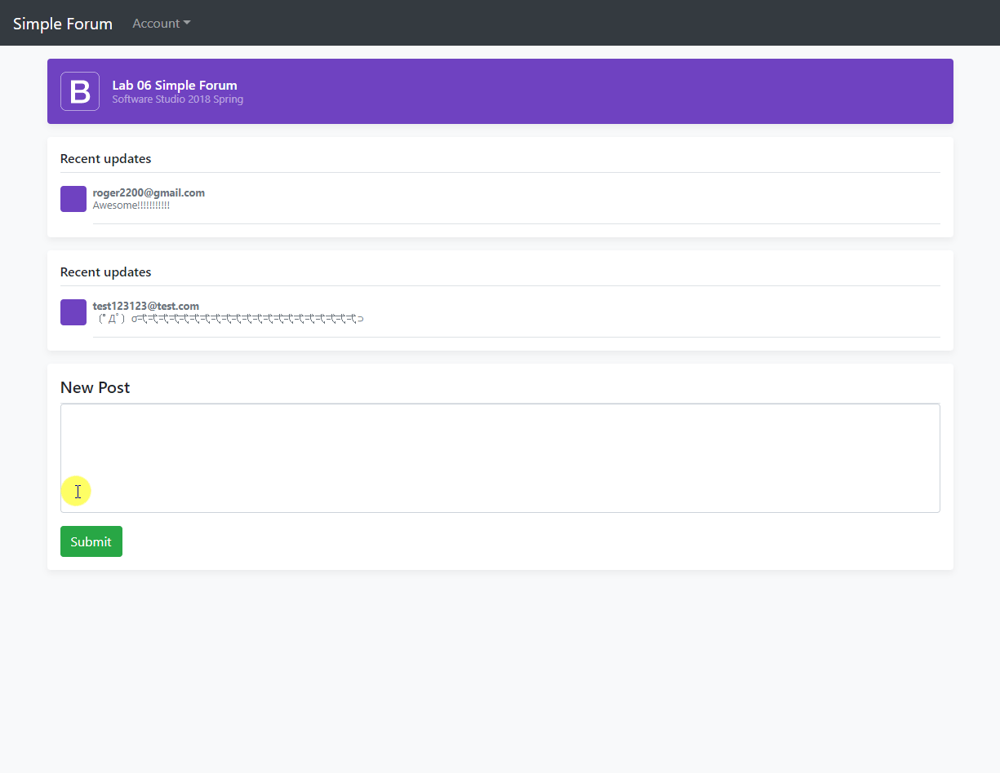

# Software Studio 2018 Spring Lab06 SimpleForum

## Grading Policy

* **Deadline: 2018/04/10 17:20 (commit time)**
* **Do not discuss to each other**
* **Deploy to Gitlab page after 17:20**

## Goal

1. Fork this repo to your account, remove fork relationship and change project visibility to public
2. Complete the simple forum
    * Trace code (.html, .js, database.rulse.json)
        * Basic Firebase usage
        * Change config.js to yours
        * Implement google and email login function
        * Realtime update database
        * Setting the rules for database read/write
    * **Finish 8 TODOs in config.js, index.js, signin.js, database.rulse.json**
3. Commit changes, and deploy to GitLab page.
